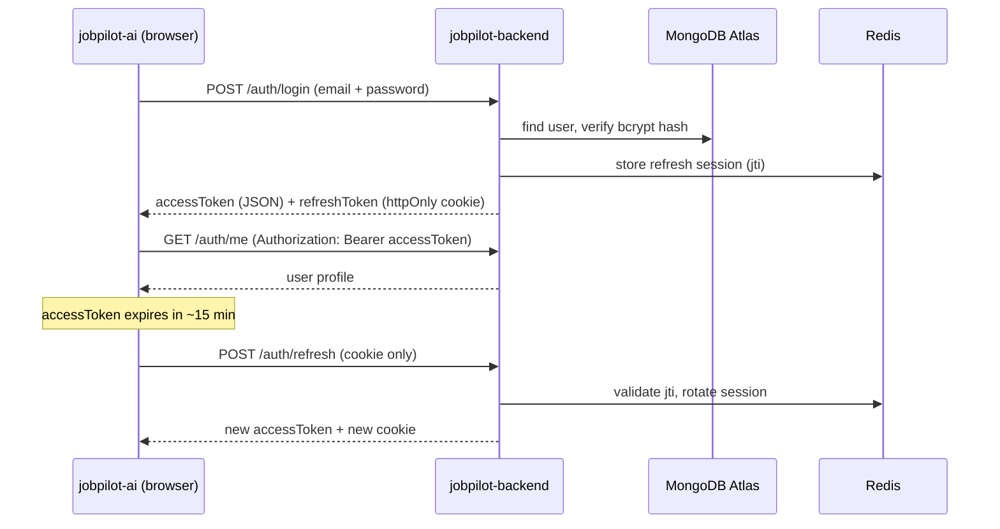
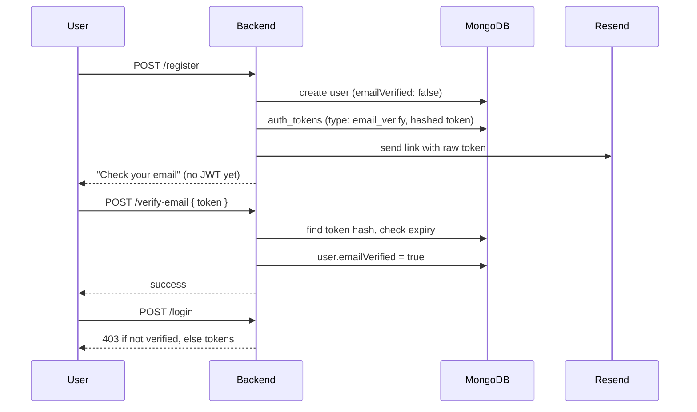
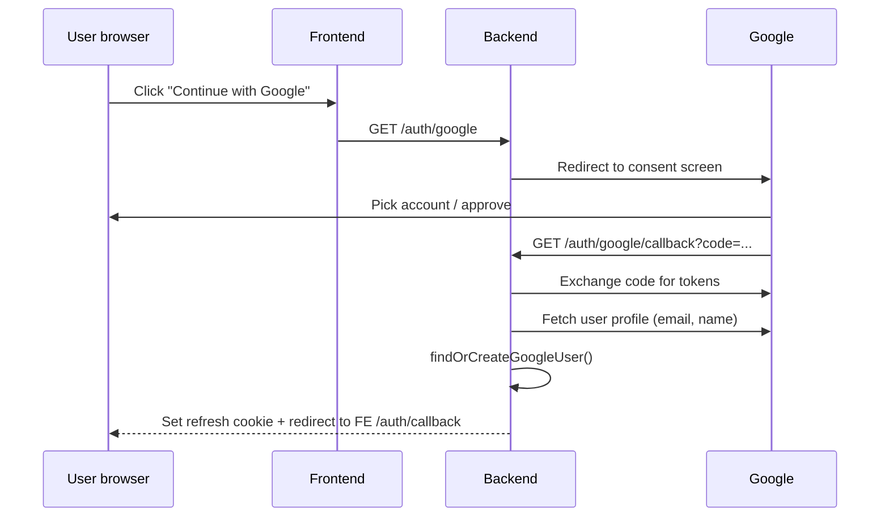
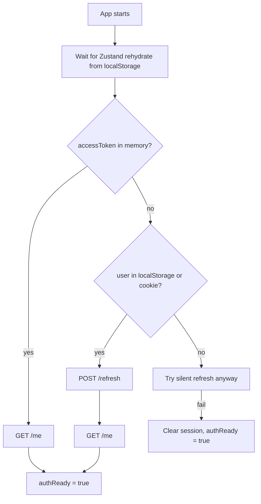

# JobPilot Authentication — Learning Guide
A concept-by-concept walkthrough of everything we built for auth in **jobpilot-backend** and **jobpilot-ai**.

For API endpoints and env vars, see [AUTH.md](./AUTH.md).  
For Oracle VM deploy, see [ORACLE-DEPLOYMENT.md](./ORACLE-DEPLOYMENT.md).

---

## Table of contents

1. [Big picture](#1-big-picture)
2. [Where data is stored](#2-where-data-is-stored)
3. [Module 0 — Foundation](#3-module-0--foundation)
4. [Module 1 — JWT sessions](#4-module-1--jwt-sessions)
5. [Module 2 — Email verification](#5-module-2--email-verification)
6. [Module 3 — Password reset](#6-module-3--password-reset)
7. [Module 4 — Google OAuth](#7-module-4--google-oauth)
8. [Module 5 — Frontend session](#8-module-5--frontend-session)
9. [Security concepts](#9-security-concepts)
10. [Production setup](#10-production-setup)
11. [Bugs we hit & lessons](#11-bugs-we-hit--lessons)

---

## 1. Big picture

JobPilot uses **stateless JWT access tokens** + **server-tracked refresh tokens**. The browser never stores long-lived secrets in `localStorage`.



### Repos

| Repo | Role |
|------|------|
| `jobpilot-backend` | NestJS API — issues tokens, talks to MongoDB + Redis |
| `jobpilot-ai` | React SPA on Cloudflare Pages — holds access token in memory, sends cookies on refresh |

### Auth methods supported

- Email + password (with verification)
- Google OAuth
- Forgot / reset password
- Silent session restore on page reload

---

## 2. Where data is stored

This confuses many people at first. **JWT login sessions are not in MongoDB.**

| Data | Storage | Why |
|------|---------|-----|
| User profile (`name`, `email`, `googleId`, …) | MongoDB `users` | Permanent account record |
| Email verify / password reset tokens | MongoDB `auth_tokens` | One-time links with expiry |
| Refresh session (`jti` → userId) | **Redis** | Fast lookup, easy revoke, TTL |
| Access token (JWT) | Browser **memory** | Short-lived, sent as `Authorization: Bearer` |
| Refresh token (JWT) | **httpOnly cookie** on API domain | JS cannot read it (XSS protection) |
| User display info for UI | `localStorage` (`jobpilot-auth`) | Survives refresh; not a secret |

```text
MongoDB users          → "Who is this person?"
MongoDB auth_tokens    → "Is this email-verify / reset link valid?" (NOT login sessions)
Redis refresh:*        → "Is this refresh token still allowed?"
Browser accessToken    → "Prove who I am for the next 15 minutes"
Browser refresh cookie → "Give me a new access token without logging in again"
```

### Session lifetime (defaults)

| Token | Lifetime | After expiry |
|-------|----------|--------------|
| Access JWT | 15 minutes | `apiFetch` calls `/refresh` automatically |
| Refresh JWT + Redis | 7 days | User must log in again |
| User in MongoDB | Forever | Same account on next login |

---

## 3. Module 0 — Foundation

**Goal:** User model, password hashing, auth module shell.

### Concepts

**Modular monolith** — One NestJS app, one deployable process. Auth lives in `src/modules/auth/` with its own schemas, services, controllers. Not a separate microservice.

**Password hashing (bcrypt)** — Never store plain passwords. `PasswordService` hashes with cost factor 12.

```text
register → bcrypt.hash(password) → passwordHash in MongoDB
login    → bcrypt.compare(password, passwordHash) → true/false
```

**User schema** (`user.schema.ts`) — Key fields:

| Field | Purpose |
|-------|---------|
| `email` | Unique login identifier (lowercased) |
| `passwordHash` | Optional — Google-only users have none |
| `googleId` | Unique, sparse — set when linked to Google |
| `authProviders` | `['local']`, `['google']`, or both |
| `emailVerified` | Gate for email/password login |
| `subscription` | Embedded subdocument for billing later |

**JWT secrets in `.env`** — `JWT_ACCESS_SECRET` and `JWT_REFRESH_SECRET` sign tokens. They are **never** in source code.

---

## 4. Module 1 — JWT sessions

**Goal:** Register, login, logout, refresh, `/me`.

### Access token vs refresh token

| | Access token | Refresh token |
|---|--------------|---------------|
| **Purpose** | Authorize API requests | Get a new access token |
| **Sent how** | `Authorization: Bearer …` header | httpOnly cookie `refreshToken` |
| **Stored server-side** | No (stateless JWT) | Yes — Redis tracks `jti` |
| **Lifetime** | Short (15m) | Long (7d) |
| **Secret** | `JWT_ACCESS_SECRET` | `JWT_REFRESH_SECRET` |

**Why two tokens?** If access token is stolen (e.g. from logs), it expires quickly. Refresh token is harder to steal (httpOnly cookie) and can be revoked in Redis.

### Refresh token rotation

Every `POST /auth/refresh`:

1. Verify JWT signature
2. Check `jti` exists in Redis
3. **Delete** old `jti` from Redis
4. Issue **new** access + refresh pair
5. Set new cookie

If an attacker replays an old refresh token, Redis won't have the `jti` → request fails. This limits replay damage.

```text
Redis keys:
  refresh:<jti>           → userId  (TTL 7 days)
  user_refresh:<userId>   → set of active jti values
```

### Cookie settings (`cookie.helper.ts`)

| Flag | Dev | Prod | Meaning |
|------|-----|------|---------|
| `httpOnly` | true | true | JavaScript cannot read cookie |
| `secure` | false | true | HTTPS only in prod |
| `sameSite` | `lax` | `none` | Cross-site cookie for Pages → API |
| `path` | `/api/v1/auth` | same | Cookie only sent to auth routes |

Prod uses `sameSite: 'none'` because frontend (`jobpilot-ai-3au.pages.dev`) and API (`jobpilot-api.duckdns.org`) are different sites.

### JwtAuthGuard + JwtStrategy

- **Strategy** — Verifies Bearer token, loads user from DB
- **Guard** — Blocks route if no valid user
- **`@CurrentUser()`** — Decorator to inject user into controller

### Key files

```text
backend/
  services/token.service.ts    # sign, verify, Redis storage
  services/auth.service.ts     # register, login, refresh, logout
  strategies/jwt.strategy.ts   # Bearer validation
  guards/jwt-auth.guard.ts
  auth.controller.ts
```

---

## 5. Module 2 — Email verification

**Goal:** Prove users own their email before login.

### Flow



### Concepts

**One-time tokens in `auth_tokens`** — Store **SHA-256 hash** of token, not raw token. If DB leaks, links still can't be used.

**Raw token in email only** — User clicks `https://frontend/verify-email?token=RAW`. Backend hashes and looks up.

**Login gate** — `emailVerified === false` → `403 Forbidden`. Stops fake signups.

**Dev mode** — If `RESEND_API_KEY=re_change_me`, link is printed to server console instead of sending email.

---

## 6. Module 3 — Password reset

**Goal:** Let users recover local (email/password) accounts.

### Flow

Same pattern as email verification:

1. `POST /forgot-password` — always returns 200 (no email enumeration)
2. Create `auth_tokens` row with `type: password_reset`, 1h TTL
3. User clicks link → `POST /reset-password { token, password }`
4. Update `passwordHash`, **revoke all Redis sessions** (`revokeAllUserSessions`)

**Google-only users** — No `passwordHash` → forgot-password silently does nothing (still returns 200).

**Security:** After reset, all refresh tokens invalidated — stolen sessions die.

---

## 7. Module 4 — Google OAuth

**Goal:** Sign in with Google; link to existing email accounts.

### OAuth 2.0 flow (simplified)



### Account linking (`findOrCreateGoogleUser`)

| Case | Action |
|------|--------|
| `googleId` already in DB | Sign in existing user |
| Email exists (local account) | Link `googleId`, add `google` to `authProviders`, mark verified |
| New email | Create user with `emailVerified: true` |

### NestJS + Passport gotcha

`PassportStrategy` wraps `validate()` and calls `done(null, result)` for you.

```typescript
// ✅ Correct — return user
async validate(..., profile): Promise<UserDocument> {
  return this.authService.findOrCreateGoogleUser(...);
}

// ❌ Wrong — also call done() manually; Nest calls done(null, undefined) after
async validate(..., profile, done) {
  done(null, user);  // overwritten → login fails
}
```

### `prompt: 'select_account'`

Google's `prompt` is an **authenticate option**, not a strategy constructor option. We pass it in `GoogleAuthGuard.getAuthenticateOptions()` so users always see the account picker.

### Google Cloud Console

- **Redirect URI** must match `GOOGLE_CALLBACK_URL` exactly
- **JS origins** = frontend URL (Pages), not backend
- **Testing mode** → add your Gmail under Test users

### Callback redirect

Backend cannot set cookies on the frontend domain. Pattern:

```text
Redirect to: {FRONTEND_URL}/auth/callback#accessToken=ENCODED_JWT
Plus: Set-Cookie: refreshToken on API domain
```

Frontend reads hash, calls `/me`, stores session.

---

## 8. Module 5 — Frontend session

**Goal:** Stay logged in after refresh; auto-refresh expired access tokens.

### Split storage (important)

```text
localStorage (jobpilot-auth)     sessionToken (memory)
├── user                         ├── accessToken  ← secret, not persisted
├── isAuthenticated              └── (lost on tab close)
├── subscription
└── isNewUser
```

**Why?** Access token in `localStorage` is vulnerable to XSS. Memory + httpOnly cookie is safer.

### AuthBootstrap (app load)



Routes wait for `authReady` so users aren't bounced to `/login` while restore is in progress.

### apiFetch 401 retry

```text
1. Request with Bearer accessToken
2. If 401 → POST /refresh (credentials: include)
3. If refresh OK → retry original request once
4. If refresh fails → clear session, show login
```

`refreshPromise` dedupes concurrent 401s so only one refresh runs at a time.

### Key frontend files

```text
jobpilot-ai/
  src/lib/session-token.ts       # in-memory token + hooks
  src/api/client.ts              # apiFetch + refresh retry
  src/store/authStore.ts         # bootstrap, login, logout
  src/components/auth/AuthBootstrap.tsx
  src/pages/AuthCallback.tsx     # Google OAuth return
```

### `VITE_API_URL`

Baked in at **build time** on Cloudflare Pages. Wrong name (`VITE_API_UR`) or missing redeploy → frontend calls `localhost:3000` in production.

---

## 9. Security concepts

### Secrets stay in environment variables

| Secret | Where |
|--------|-------|
| JWT secrets | VM `.env` only |
| Google client secret | VM `.env` only |
| MongoDB URI | VM `.env` only |
| `VITE_API_URL` | Cloudflare Pages (public URL, not secret) |

### CORS

Backend allows `FRONTEND_URL` with `credentials: true` so cookies are sent on `/refresh`.

### bcrypt cost 12

Slower hashing = harder brute-force. Don't lower without reason.

### Rate limiting

Register, login, resend-verification throttled via `@Throttle()` to slow abuse.

### Logout

1. Revoke `jti` in Redis
2. Clear refresh cookie
3. Frontend clears memory + localStorage

Logout does **not** sign user out of Google — only JobPilot session.

---

## 10. Production setup

### Backend VM (`~/oracle/apps/jobpilot-backend/.env`)

```env
PORT=3001
NODE_ENV=production
MONGODB_URI=mongodb+srv://...
REDIS_HOST=127.0.0.1
REDIS_PORT=6379
JWT_ACCESS_SECRET=<openssl rand -base64 48>
JWT_REFRESH_SECRET=<different secret>
FRONTEND_URL=https://jobpilot-ai-3au.pages.dev
GOOGLE_CLIENT_ID=...
GOOGLE_CLIENT_SECRET=...
GOOGLE_CALLBACK_URL=https://jobpilot-api.duckdns.org/api/v1/auth/google/callback
RESEND_API_KEY=...
```

### Frontend (Cloudflare Pages)

```env
VITE_API_URL=https://jobpilot-api.duckdns.org
```

Type: **Text**. Redeploy after change.

### Deploy commands

```bash
cd ~/oracle/apps/jobpilot-backend
git fetch origin main && git reset --hard origin/main
npm ci && npm run build
pm2 restart jobpilot-api --update-env
```

### Verify

```bash
curl -sk https://jobpilot-api.duckdns.org/api/v1/health
curl -sk -o /dev/null -w "%{http_code}" https://jobpilot-api.duckdns.org/api/v1/auth/google
# Expect 302 (redirect), not 404
```

---

## 11. Bugs we hit & lessons

| Problem | Cause | Fix |
|---------|-------|-----|
| `Google OAuth is not configured` | Server started before `.env` had Google vars | Restart backend after `.env` changes |
| `bad auth` MongoDB | Angle brackets in URI password `<pass>` | Remove `<>` from `MONGODB_URI` |
| `Cannot set headers after they are sent` | Guard redirected but didn't throw; controller still ran | Throw after redirect in `handleRequest` |
| Google login always failed | `validate()` called `done()` + Nest also called `done(null, undefined)` | Return user from `validate()`, no manual `done()` |
| `emailVerified` false from Google | Google omits `verified` field | Treat missing as `true` |
| Prod calls `localhost:3000` | `VITE_API_URL` typo or no redeploy | Fix env name, redeploy Pages |
| `404` on `/auth/google` prod | Old code on VM | `git pull`, `npm run build`, `pm2 restart` |
| `package-lock.json` merge block | Local changes on VM | `git reset --hard origin/main` |
| Instant Google login after logout | Google SSO still active in browser | Expected; use incognito or `prompt: select_account` |
| Empty `auth_tokens` in Atlas | Google login doesn't use that collection | Sessions are in Redis, not MongoDB |
| `prompt` TypeScript error | Wrong option location | `getAuthenticateOptions()` on guard |

---

## Suggested learning order

1. Read [Module 1](#4-module-1--jwt-sessions) — core mental model
2. Trace one login in DevTools Network tab
3. Read [Where data is stored](#2-where-data-is-stored)
4. Try register → verify → login flow locally
5. Read [Google OAuth](#7-module-4--google-oauth) and trace Network during Google sign-in
6. Read [Frontend session](#8-module-5--frontend-session), refresh page, watch `/refresh` call
7. Read [Security](#9-security-concepts) before production changes

---

## Quick reference — all endpoints

| Method | Path | Purpose |
|--------|------|---------|
| POST | `/auth/register` | Create account |
| POST | `/auth/verify-email` | Verify email |
| POST | `/auth/resend-verification` | Resend verify email |
| POST | `/auth/login` | Email login |
| POST | `/auth/forgot-password` | Request reset |
| POST | `/auth/reset-password` | Set new password |
| GET | `/auth/google` | Start Google OAuth |
| GET | `/auth/google/callback` | Google OAuth return |
| POST | `/auth/refresh` | New access token |
| POST | `/auth/logout` | End session |
| GET | `/auth/me` | Current user |

---

*Last updated: June 2026 — matches auth v1 implementation.*
