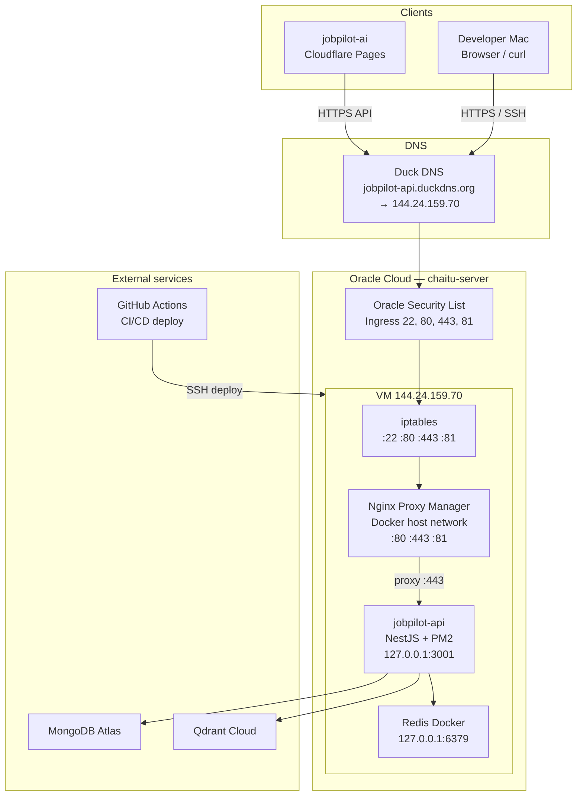
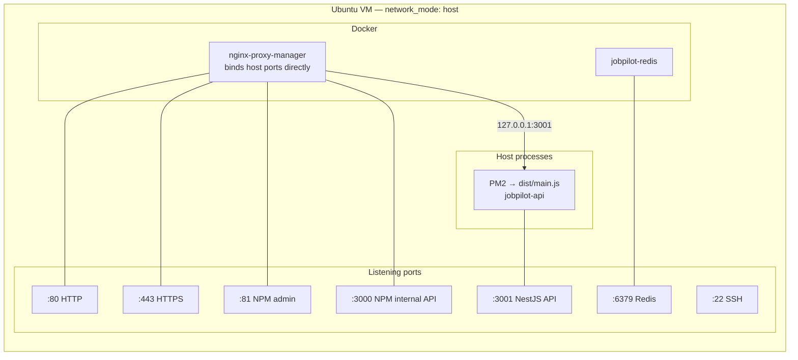
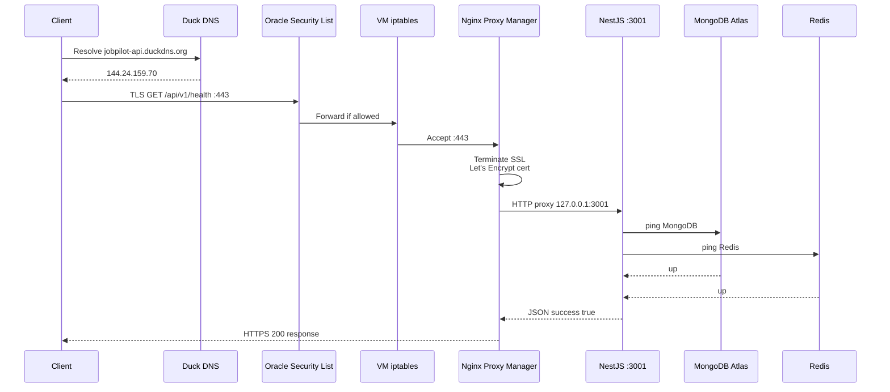
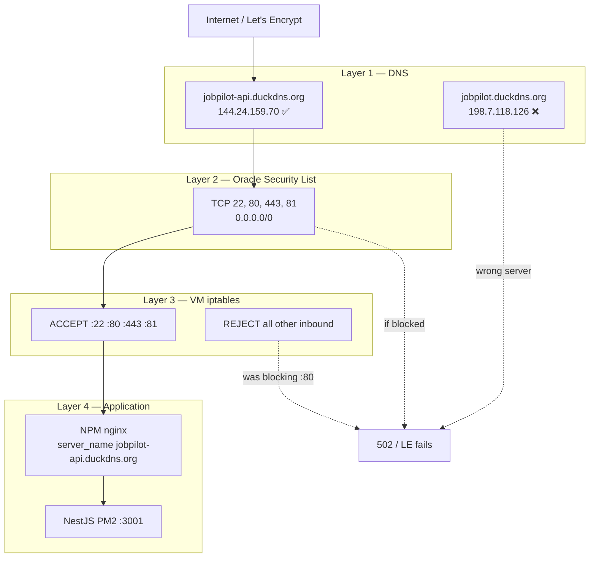
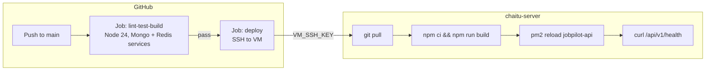
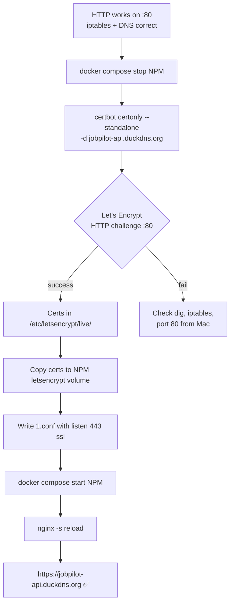
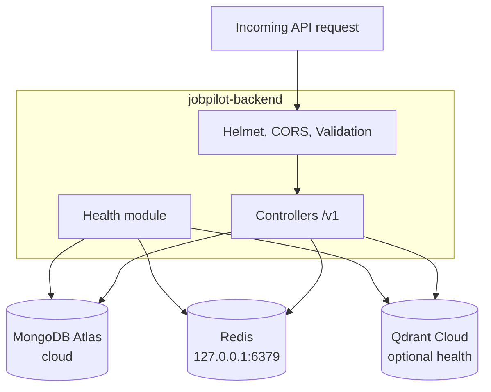
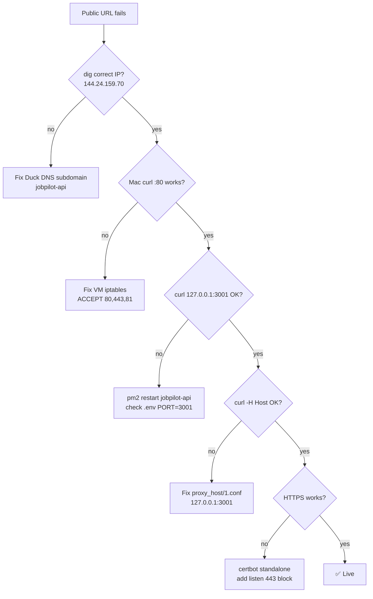

# JobPilot — Oracle VM Deployment & Debugging Guide

Complete guide for the production API on Oracle Cloud: architecture, configuration, operations, and every issue we hit while debugging.

**VM:** `ubuntu@144.24.159.70` (`chaitu-server`)  
**Public API:** `https://jobpilot-api.duckdns.org`  
**Health check:** `https://jobpilot-api.duckdns.org/api/v1/health`

---

## Table of contents

**Deployment**
1. [Architecture](#1-architecture)
   - [System design diagrams](#system-design-diagrams)
2. [VM layout](#2-vm-layout)
3. [Final configuration](#3-final-configuration)
4. [Initial setup](#4-initial-setup)
5. [Operations](#5-operations)
6. [GitHub CI/CD](#6-github-cicd)
7. [Frontend integration](#7-frontend-integration)
8. [Verification checklist](#8-verification-checklist)

**Debugging learnings**
9. [Executive summary](#9-executive-summary)
10. [Root cause layers](#10-root-cause-layers)
11. [Issue timeline](#11-issue-timeline)
12. [Fix order that worked](#12-fix-order-that-worked)
13. [Diagnostic commands](#13-diagnostic-commands)
14. [Lessons learned](#14-lessons-learned)
15. [Troubleshooting cheat sheet](#15-troubleshooting-cheat-sheet)

---

# Deployment

## 1. Architecture

```text
Cloudflare Pages (React frontend) — jobpilot-ai
         │
    HTTPS API calls
         ▼
Duck DNS: jobpilot-api.duckdns.org → 144.24.159.70
         │
         ▼
Oracle VM (chaitu-server)
├── iptables: allow TCP 22, 80, 443, 81
├── Nginx Proxy Manager (Docker, network_mode: host)
│     :80  → HTTP proxy
│     :443 → HTTPS (Let's Encrypt cert)
│     :81  → NPM admin UI (SSH tunnel from Mac)
│     └── forwards to → 127.0.0.1:3001
│
└── jobpilot-backend (PM2: jobpilot-api)
      NestJS on PORT=3001
         │
    ┌────┴────┬────────────┐
    ▼         ▼            ▼
MongoDB    Qdrant Cloud   Redis
Atlas                   (Docker 127.0.0.1:6379)
```

### Port map

| Port | Service | Notes |
|------|---------|-------|
| 22 | SSH | Always allowed |
| 80 | NPM HTTP | Let's Encrypt validation |
| 443 | NPM HTTPS | Public API |
| 81 | NPM admin | Use SSH tunnel, not public internet |
| 3000 | NPM internal API | Do **not** run NestJS here |
| **3001** | **JobPilot API** | PM2 / NestJS |
| 6379 | Redis | Localhost only |

### Public URLs

| Purpose | URL |
|---------|-----|
| Health check | `https://jobpilot-api.duckdns.org/api/v1/health` |
| Swagger | `https://jobpilot-api.duckdns.org/api/docs` |
| API base | `https://jobpilot-api.duckdns.org` |

### System design diagrams

#### High-level system overview



#### VM component diagram



#### HTTPS request flow (health check)



#### Network and firewall layers



#### CI/CD deployment flow



#### SSL certificate issuance flow



#### Data flow (API dependencies)



#### Debugging decision flow



---

## 2. VM layout

```text
/home/ubuntu/oracle/
├── apps/jobpilot-backend/         ← Git repo, PM2
├── infra/
│   ├── nginx-proxy-manager/       ← Reverse proxy + SSL
│   │   ├── docker-compose.yml
│   │   ├── data/
│   │   └── letsencrypt/
│   ├── docker/                    ← Redis
│   └── portainer/
├── bots/telegram/
├── data/
├── backups/
├── logs/
└── scripts/
```

---

## 3. Final configuration

### 3.1 JobPilot `.env`

Path: `~/oracle/apps/jobpilot-backend/.env`

```env
PORT=3001
NODE_ENV=production
MONGODB_URI=mongodb+srv://...
REDIS_HOST=127.0.0.1
REDIS_PORT=6379
REDIS_PASSWORD=...
HEALTH_CHECK_QDRANT=false
FRONTEND_URL=https://your-app.pages.dev
JWT_ACCESS_SECRET=...
JWT_REFRESH_SECRET=...
RESEND_API_KEY=...
```

```bash
pm2 restart jobpilot-api --update-env
```

### 3.2 NPM `docker-compose.yml`

Path: `~/oracle/infra/nginx-proxy-manager/docker-compose.yml`

```yaml
services:
  npm:
    image: jc21/nginx-proxy-manager:latest
    container_name: nginx-proxy-manager
    restart: unless-stopped
    network_mode: host

    volumes:
      - ./data:/data
      - ./letsencrypt:/etc/letsencrypt
```

**Why `network_mode: host`?** Docker bridge on Oracle Cloud cannot reach the host API (`curl` from inside NPM container returned `000` for all host IPs).

### 3.3 NPM proxy config

Path: `~/oracle/infra/nginx-proxy-manager/data/nginx/proxy_host/1.conf`

```nginx
server {
  set $forward_scheme http;
  set $server         "127.0.0.1";
  set $port           3001;

  listen 80;
  listen [::]:80;
  server_name jobpilot-api.duckdns.org;

  include conf.d/include/letsencrypt-acme-challenge.conf;

  location / {
    include conf.d/include/proxy.conf;
  }
}

server {
  set $forward_scheme http;
  set $server         "127.0.0.1";
  set $port           3001;

  listen 443 ssl;
  listen [::]:443 ssl;
  server_name jobpilot-api.duckdns.org;

  ssl_certificate     /etc/letsencrypt/live/jobpilot-api.duckdns.org/fullchain.pem;
  ssl_certificate_key /etc/letsencrypt/live/jobpilot-api.duckdns.org/privkey.pem;

  include conf.d/include/ssl-ciphers.conf;
  include conf.d/include/ssl-cache.conf;

  location / {
    include conf.d/include/proxy.conf;
  }
}
```

```bash
docker exec nginx-proxy-manager nginx -t
docker exec nginx-proxy-manager nginx -s reload
```

### 3.4 VM iptables

Oracle Ubuntu images default to **only allowing SSH (22)**. Open web ports:

```bash
sudo iptables -I INPUT 6 -p tcp -m multiport --dports 80,443,81 -j ACCEPT
sudo apt install -y iptables-persistent
sudo netfilter-persistent save
```

### 3.5 Duck DNS

| Subdomain | IP | Status |
|-----------|-----|--------|
| **`jobpilot-api.duckdns.org`** | `144.24.159.70` | ✅ Use this |
| `jobpilot.duckdns.org` | `198.7.118.126` | ❌ Wrong server |

### 3.6 SSL certificate

Issued via **certbot standalone** (NPM UI SSL kept failing):

```bash
cd ~/oracle/infra/nginx-proxy-manager
docker compose stop

sudo certbot certonly --standalone \
  -d jobpilot-api.duckdns.org \
  -m your@email.com \
  --agree-tos --no-eff-email --non-interactive

docker compose start

sudo mkdir -p letsencrypt/live/jobpilot-api.duckdns.org
sudo cp /etc/letsencrypt/live/jobpilot-api.duckdns.org/*.pem \
  letsencrypt/live/jobpilot-api.duckdns.org/
```

Cert expires **2026-09-24**. Renew with `sudo certbot renew` (stop NPM first).

---

## 4. Initial setup

```bash
# API
cd ~/oracle/apps/jobpilot-backend
cp .env.example .env
npm ci && npm run build
pm2 start dist/main.js --name jobpilot-api
pm2 save && pm2 startup

# NPM
cd ~/oracle/infra/nginx-proxy-manager
docker compose up -d

# NPM admin (from Mac, not VM)
ssh -i ~/.ssh/chaitu-lab-vm.key -L 8181:127.0.0.1:81 ubuntu@144.24.159.70
# Browser: http://localhost:8181
```

---

## 5. Operations

```bash
# Health
curl -s http://127.0.0.1:3001/api/v1/health
curl -sk https://jobpilot-api.duckdns.org/api/v1/health

# PM2
pm2 status
pm2 logs jobpilot-api --lines 50
pm2 restart jobpilot-api --update-env

# NPM
cd ~/oracle/infra/nginx-proxy-manager
docker compose ps
docker logs nginx-proxy-manager --tail 50
docker exec nginx-proxy-manager nginx -t

# Manual deploy
cd ~/oracle/apps/jobpilot-backend
git pull origin main && npm ci && npm run build
pm2 reload jobpilot-api --update-env
```

---

## 6. GitHub CI/CD

**Workflow:** `.github/workflows/ci.yml`

| Secret | Value |
|--------|-------|
| `VM_HOST` | `144.24.159.70` |
| `VM_USER` | `ubuntu` |
| `VM_SSH_KEY` | `~/.ssh/chaitu-lab-vm.key` contents |
| `APP_DIR` | `/home/ubuntu/oracle/apps/jobpilot-backend` |

---

## 7. Frontend integration

```env
# jobpilot-ai
VITE_API_URL=https://jobpilot-api.duckdns.org

# backend .env
FRONTEND_URL=https://your-app.pages.dev
```

---

## 8. Verification checklist

```bash
dig +short jobpilot-api.duckdns.org          # → 144.24.159.70
curl -s http://127.0.0.1:3001/api/v1/health
sudo iptables -L INPUT -n | grep 80          # → ACCEPT
curl -sk https://jobpilot-api.duckdns.org/api/v1/health
pm2 status
```

---

# Debugging learnings

## 9. Executive summary

**What looked broken:** `502 Bad Gateway`, `000` from Docker, Let's Encrypt failures, NPM "Internal Error".

**What was actually wrong (stacked):**

1. Wrong Duck DNS subdomain (`jobpilot` vs `jobpilot-api`)
2. **VM iptables only allowed SSH** — ports 80/443 blocked despite Oracle Security List being open
3. Docker bridge could not reach the host API
4. Port 3000 conflict (NPM internal API vs NestJS)
5. NPM database and nginx config files out of sync

**Main blocker:** VM **iptables**, not NPM or NestJS.

---

## 10. Root cause layers

```text
┌─────────────────────────────────────────────────────────────┐
│  Layer 1: Wrong DNS subdomain (jobpilot vs jobpilot-api)   │
├─────────────────────────────────────────────────────────────┤
│  Layer 2: VM iptables only allowed SSH — blocked 80/443/81 │  ← main blocker
├─────────────────────────────────────────────────────────────┤
│  Layer 3: Docker bridge couldn't reach host → host network  │
├─────────────────────────────────────────────────────────────┤
│  Layer 4: Port 3000 conflict (NPM backend vs NestJS)       │
├─────────────────────────────────────────────────────────────┤
│  Layer 5: NPM DB/config out of sync → manual nginx conf    │
└─────────────────────────────────────────────────────────────┘
```

---

## 11. Issue timeline

### Issue 1: Docker cannot reach host (`000`)

- **Symptom:** `docker exec nginx-proxy-manager curl http://10.0.1.93:3000/...` → `000`
- **Cause:** Oracle blocks Docker bridge → host traffic
- **Failed:** `host.docker.internal`, `172.17.0.1`, private IP forwarding
- **Fix:** NPM `network_mode: host`

### Issue 2: Port 3000 conflict

- **Symptom:** NPM UI stuck on "Loading..."; log: `Backend PID listening on port 3000`
- **Cause:** NPM internal API and NestJS both on port 3000
- **Fix:** `PORT=3001` for NestJS

### Issue 3: NPM proxy wrong target

- **Symptom:** Public `502`; local `:3001` worked
- **Cause:** Forwarded to `10.0.1.93:3000` instead of `127.0.0.1:3001`
- **Fix:** Update `1.conf`

### Issue 4: Wrong Duck DNS subdomain

- **Symptom:** Let's Encrypt always failed
- **Cause:** `jobpilot.duckdns.org` → `198.7.118.126` (wrong machine)
- **Fix:** Use `jobpilot-api.duckdns.org` → `144.24.159.70`

### Issue 5: HTTPS 502 — no `listen 443`

- **Symptom:** HTTP `301` → HTTPS `502`
- **Cause:** Only `listen 80` in nginx config
- **Fix:** Add `listen 443 ssl` block with certs

### Issue 6: NPM "Internal Error" on SSL

- **Causes:** Wrong DNS + Force SSL before cert + iptables + DB/config mismatch
- **Fix:** Correct DNS → Force SSL OFF → iptables → certbot standalone

### Issue 7: VM iptables (main blocker)

- **Symptom:** Mac `curl :80` → connection refused; `nc` port 22 OK, port 80 "No route to host"
- **Cause:** INPUT chain only allowed port 22, then `REJECT all`
- **Fix:** `iptables -I INPUT 6 ... dports 80,443,81 -j ACCEPT` + persist

### Issue 8: NPM DB vs nginx out of sync

- **Symptom:** DB correct but `1.conf` had old domain
- **Fix:** Edit `1.conf` manually; update DB with `sudo python3` + sqlite3 module

### Issue 9: NPM admin `:81` unreachable

- **Fix:** SSH tunnel from **Mac**: `ssh -L 8181:127.0.0.1:81 ...`

### Issue 10: GitHub Actions SSH failed

- **Fix:** Use `~/.ssh/chaitu-lab-vm.key` in `VM_SSH_KEY` secret

### Issue 11: certbot hung on prompt

- **Fix:** Add `--non-interactive --no-eff-email`

---

## 12. Fix order that worked

```text
1. network_mode: host for NPM
2. PORT=3001 for NestJS
3. jobpilot-api.duckdns.org (correct DNS)
4. iptables ACCEPT for 80, 443, 81
5. Manual 1.conf for HTTP → 127.0.0.1:3001
6. certbot --standalone for SSL
7. Add HTTPS block to 1.conf
8. netfilter-persistent save
```

---

## 13. Diagnostic commands

```bash
# DNS
dig +short jobpilot-api.duckdns.org

# API
curl -s http://127.0.0.1:3001/api/v1/health
pm2 status

# NPM routing (bypass DNS)
curl -s http://127.0.0.1/api/v1/health -H "Host: jobpilot-api.duckdns.org"

# ACME path (good = 404, bad = 301/000)
curl -sv http://jobpilot-api.duckdns.org/.well-known/acme-challenge/test 2>&1 | grep '< HTTP'

# Port 80 from Mac
nc -zv 144.24.159.70 80

# iptables
sudo iptables -L INPUT -n -v --line-numbers

# Logs
docker logs nginx-proxy-manager --tail 30
sudo tail -30 /var/log/letsencrypt/letsencrypt.log

# nginx
grep -E 'server_name|listen' ~/oracle/infra/nginx-proxy-manager/data/nginx/proxy_host/1.conf
docker exec nginx-proxy-manager nginx -t

# Isolation test for port 80
docker compose stop && sudo python3 -m http.server 80 &
# curl from Mac, then: sudo kill $(sudo lsof -t -i:80) && docker compose start
```

### Mental model

```text
Internet → Oracle Security List → VM iptables → NPM (:443) → NestJS (:3001)

Debug each hop:
  1. dig          → DNS correct?
  2. Mac curl :80 → iptables open?
  3. curl :3001   → API up?
  4. curl -H Host → NPM routing?
  5. grep 1.conf  → SSL block exists?
```

---

## 14. Lessons learned

### Do

- Run `dig` before SSL
- Test port 80 from your **Mac**
- Check **VM iptables** AND Oracle Security List
- Use `127.0.0.1:3001` for NPM forward
- SSH tunnel for NPM admin
- `certbot --standalone` when NPM SSL UI fails
- Edit `1.conf` directly when UI/DB diverge
- Persist iptables rules

### Don't

- Don't use `jobpilot.duckdns.org` (wrong IP)
- Don't run NestJS on port 3000 with NPM host mode
- Don't enable Force SSL before cert exists
- Don't run SSH `-L` on the VM itself
- Don't assume Security List alone opens ports

---

## 15. Troubleshooting cheat sheet

| Symptom | Likely cause | Fix |
|---------|--------------|-----|
| `000` from NPM container | Docker bridge blocked | `network_mode: host` |
| NPM UI "Loading..." | Port 3000 conflict | `PORT=3001` |
| `502` public, local OK | Wrong forward / no SSL | Fix `1.conf` |
| Let's Encrypt fails | DNS / iptables / Force SSL | `dig`, iptables, certbot |
| Mac refused on :80 | VM iptables | ACCEPT 80,443,81 |
| `404` + `SimpleHTTP` | Python test server on :80 | Kill python, start NPM |
| NPM "Internal Error" | certbot / DB sync | Logs + manual conf |
| `nc` 22 OK, 80 failed | iptables REJECT | Insert ACCEPT before REJECT |

---

*Local development: [README.md](../README.md)*
