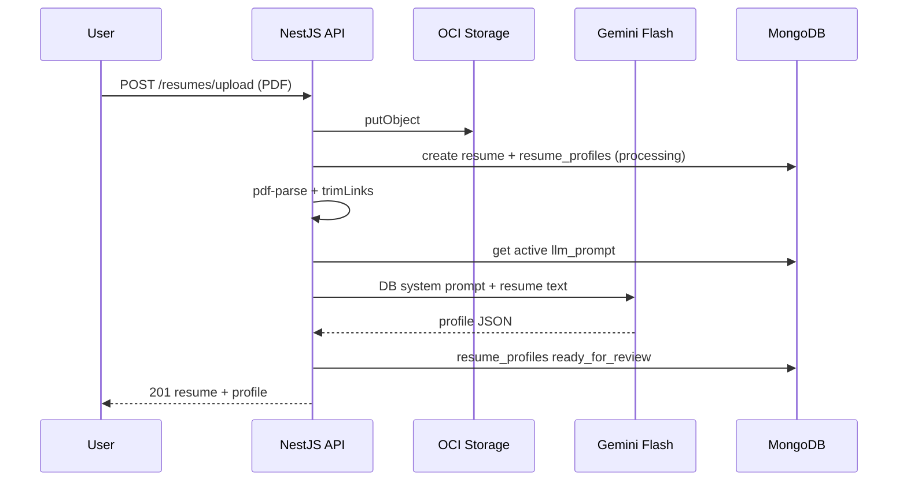

# JobPilot — Resume profile extraction (Gemini)

Technical plan for **PDF upload → text → link trim → one Gemini Flash call → profile JSON → profile editor**.

**Prompt storage:** MongoDB collection `llm_prompts` (not hardcoded in app code).

**Seed reference:** [prompts/resume-profile-extraction.prompt.md](./prompts/resume-profile-extraction.prompt.md) — copy into DB once via seed script; edit prompts in DB after that.

**Related:** resume storage (OCI/local) is already implemented. This doc covers extraction only (no Qdrant in v1).

---

## 1. Goals

| Goal | Approach |
|------|----------|
| Extract skills, experience, technologies, years, certs, education, projects | One Gemini Flash call |
| No hardcoded resume section names | LLM discovers sections from text |
| Low cost | One call per upload; trim **links only** before LLM |
| User can fix gaps | Profile editor after extraction (`ready_for_review` → `confirmed`) |
| No repeat LLM on match | Store JSON in MongoDB; Qdrant later on confirm |

---

## 2. Architecture (synchronous — no background job)

```text
POST /resumes/upload
  │
  ├─ Save PDF → OCI (or local)
  ├─ Create Resume doc
  ├─ Create / update resume_profiles row (resumeId + userId)
  ├─ pdf-parse → fullText (from upload buffer)
  ├─ trimLinks(fullText)          ← only trim step for v1
  ├─ Load active prompt from MongoDB (llm_prompts)
  ├─ Gemini Flash + DB prompt → profile JSON
  ├─ Validate + normalize JSON
  ├─ Save resume_profiles (extractionStatus: ready_for_review | failed)
  ├─ Sync skillsExtracted on Resume doc
  └─ Return 201 with resume + profile (upload waits for LLM)

User: Profile editor
  │
  PATCH /resumes/profile → save edits
  POST  /resumes/profile/confirm → extractionStatus: confirmed
  (Qdrant embed on confirm — later module)
```



---

## 3. Dependencies

```bash
cd jobpilot-backend
npm install pdf-parse @google/generative-ai
npm install -D @types/pdf-parse
```

| Package | Purpose |
|---------|---------|
| `pdf-parse` | PDF buffer → plain text |
| `@google/generative-ai` | Gemini Flash API |

---

## 4. Environment variables

Add to `.env` / VM production `.env`:

```env
# Gemini
GEMINI_API_KEY=
GEMINI_MODEL=gemini-2.0-flash
GEMINI_MAX_OUTPUT_TOKENS=4096

# Extraction
RESUME_EXTRACTION_ENABLED=true
RESUME_EXTRACTION_QUEUE=resume-extraction
```

Add to `config.validation.ts`:

```typescript
@IsOptional() @IsString() GEMINI_API_KEY?: string;
@IsOptional() @IsString() GEMINI_MODEL?: string;
@IsOptional() @IsBoolean() RESUME_EXTRACTION_ENABLED?: boolean;
```

---

## 5. Link trimming only (v1)

**Do not** trim skills, jobs, or certifications in v1.  
**Only** remove URLs and social links to save tokens and reduce noise.

### `resume-text-trimmer.service.ts`

```typescript
const LINK_PATTERNS: RegExp[] = [
  /https?:\/\/[^\s)>\]]+/gi,
  /www\.[^\s)>\]]+/gi,
  /\b[\w.-]+@[\w.-]+\.\w{2,}\b/gi,                    // email
  /\blinkedin\.com\/[^\s)>\]]+/gi,
  /\bgithub\.com\/[^\s)>\]]+/gi,
  /\bgitlab\.com\/[^\s)>\]]+/gi,
  /\b(bit\.ly|tinyurl\.com|t\.co)\/[^\s)>\]]+/gi,
  /\b(portfolio|website|blog)\s*:\s*[^\s]+/gi,
];

export function trimResumeLinks(text: string): string {
  let cleaned = text;
  for (const pattern of LINK_PATTERNS) {
    cleaned = cleaned.replace(pattern, ' ');
  }
  return cleaned.replace(/[ \t]+/g, ' ').replace(/\n{3,}/g, '\n\n').trim();
}
```

Optional: store extracted links separately later (`profile.links.linkedin`) — not in v1.

---

## 6. PDF → text

### `pdf-text-extractor.service.ts`

```typescript
import pdf from 'pdf-parse';

export async function extractTextFromPdfBuffer(buffer: Buffer): Promise<string> {
  const { text } = await pdf(buffer);
  if (!text || text.trim().length < 50) {
    throw new Error('PDF text extraction returned empty content (scanned PDF?)');
  }
  return text;
}
```

### Read PDF from storage

Reuse `ResumeStorageService.openReadStream(storagePath)` → collect to `Buffer` (helper `streamToBuffer`).

At upload you may also pass `file.buffer` to the queue job to avoid an extra OCI read (optional optimization).

---

## 7. Prompts in MongoDB (not in code)

Prompts live in the **`llm_prompts`** collection so you can change extraction behavior **without redeploying** the API.

### 7.1 Schema — `llm_prompts`

```typescript
// src/modules/llm-prompts/schemas/llm-prompt.schema.ts

@Schema({ timestamps: true, collection: 'llm_prompts' })
export class LlmPrompt {
  @Prop({ required: true, unique: true, trim: true })
  key: string;                    // e.g. "resume-profile-extraction"

  @Prop({ required: true, default: 1 })
  version: number;                // increment when you change prompt

  @Prop({ required: true })
  systemPrompt: string;           // full system instruction

  @Prop({ required: true })
  userMessageTemplate: string;    // must include {{resumeText}}

  @Prop({ default: true })
  isActive: boolean;               // only one active row per key

  @Prop({ default: 'gemini-2.0-flash' })
  model: string;

  @Prop({ default: 0.1 })
  temperature: number;

  @Prop({ default: 4096 })
  maxOutputTokens: number;

  @Prop({ default: 'application/json' })
  responseMimeType: string;

  @Prop()
  description?: string;           // human note, e.g. "Resume upload v1"
}

// Index: { key: 1, isActive: 1 } unique partial filter isActive: true
```

### 7.2 `userMessageTemplate` in DB

Store the user message wrapper in DB too (not only system prompt):

```text
Extract the resume profile from the text below.

--- RESUME TEXT START ---
{{resumeText}}
--- RESUME TEXT END ---
```

At runtime: `userMessageTemplate.replace('{{resumeText}}', trimmedText)`.

### 7.3 `LlmPromptService`

```typescript
@Injectable()
export class LlmPromptService {
  private cache = new Map<string, { prompt: LlmPromptDocument; expiresAt: number }>();
  private readonly ttlMs = 60_000; // refresh from DB every 60s

  async getActivePrompt(key: string): Promise<LlmPromptDocument> {
    const cached = this.cache.get(key);
    if (cached && cached.expiresAt > Date.now()) return cached.prompt;

    const prompt = await this.llmPromptModel
      .findOne({ key, isActive: true })
      .exec();

    if (!prompt) {
      throw new NotFoundException(`Active LLM prompt not found: ${key}`);
    }

    this.cache.set(key, { prompt, expiresAt: Date.now() + this.ttlMs });
    return prompt;
  }

  invalidateCache(key?: string): void {
    if (key) this.cache.delete(key);
    else this.cache.clear();
  }
}
```

**Why cache?** One MongoDB read per minute per prompt key — not per upload. Uploads stay fast.

### 7.4 Seed script (one-time / on deploy)

Seed from the markdown reference file, **not** from runtime code:

```typescript
// scripts/seed-llm-prompts.ts  OR  OnModuleInit in dev only

const PROMPT_KEY = 'resume-profile-extraction';

await llmPromptModel.updateOne(
  { key: PROMPT_KEY, isActive: true },
  {
    $setOnInsert: {
      key: PROMPT_KEY,
      version: 1,
      isActive: true,
      systemPrompt: readFileSync('docs/prompts/resume-profile-extraction.prompt.md', 'utf8'),
      userMessageTemplate: `Extract the resume profile from the text below.

--- RESUME TEXT START ---
{{resumeText}}
--- RESUME TEXT END ---`,
      model: 'gemini-2.0-flash',
      temperature: 0.1,
      maxOutputTokens: 4096,
      responseMimeType: 'application/json',
      description: 'Resume profile extraction v1',
    },
  },
  { upsert: true },
);
```

Run after deploy:

```bash
npm run seed:llm-prompts
```

**Rule:** `.md` file = documentation + initial seed content. **Production uses DB.**

### 7.5 Updating a prompt (no code deploy)

**Option A — MongoDB Compass / mongosh**

```javascript
db.llm_prompts.updateOne(
  { key: "resume-profile-extraction", isActive: true },
  {
    $set: {
      systemPrompt: "... new prompt ...",
      version: 2,
      updatedAt: new Date()
    }
  }
)
```

Restart not required — cache TTL clears within 60s, or call `invalidateCache()` if you add an admin endpoint.

**Option B — Admin API (later)**

```text
PATCH /api/v1/admin/llm-prompts/:key   (admin only)
```

Creates new version row, sets old `isActive: false`, new row `isActive: true`.

### 7.6 Prompt keys (convention)

| key | Used for |
|-----|----------|
| `resume-profile-extraction` | Upload → profile JSON |
| `job-description-parse` | Later — job scraping |
| `cover-letter-generate` | Later — optional |

One document per **active** key. Version history optional (separate rows with `isActive: false`).

---

## 8. Gemini extraction service

### `gemini-resume-extractor.service.ts`

Responsibilities:

1. **`LlmPromptService.getActivePrompt('resume-profile-extraction')`** — load from DB.
2. Replace `{{resumeText}}` in `userMessageTemplate`.
3. Call Gemini with `prompt.llmModel`, `temperature`, `maxOutputTokens` from DB row.
4. Parse and validate JSON.
5. Return `ResumeProfile` type.

```typescript
const PROMPT_KEY = 'resume-profile-extraction';

@Injectable()
export class GeminiResumeExtractorService {
  constructor(private readonly llmPromptService: LlmPromptService) {}

  async extractProfile(trimmedText: string): Promise<ResumeProfile> {
    const prompt = await this.llmPromptService.getActivePrompt(PROMPT_KEY);

    const userMessage = prompt.userMessageTemplate.replace(
      '{{resumeText}}',
      trimmedText,
    );

    const genAI = new GoogleGenerativeAI(this.config.getOrThrow('GEMINI_API_KEY'));
    const model = genAI.getGenerativeModel({
      model: prompt.llmModel,
      generationConfig: {
        temperature: prompt.temperature,
        maxOutputTokens: prompt.maxOutputTokens,
        responseMimeType: prompt.responseMimeType,
      },
    });

    const result = await model.generateContent([
      { text: prompt.systemPrompt },
      { text: userMessage },
    ]);

    return validateResumeProfile(JSON.parse(result.response.text()));
  }
}
```

**No prompt strings in this file** — only the key constant `resume-profile-extraction`.

Handle failures: set `extractionStatus: failed`, store `extractionError` message.

---

## 9. MongoDB schema changes

### `resume.schema.ts` — add fields

```typescript
export enum ExtractionStatus {
  Pending = 'pending',
  Processing = 'processing',
  ReadyForReview = 'ready_for_review',
  Confirmed = 'confirmed',
  Failed = 'failed',
}

@Schema({ _id: false })
export class ExperienceEntry {
  @Prop() company: string;
  @Prop() role: string;
  @Prop() location?: string;
  @Prop() startDate?: string;
  @Prop() endDate?: string;
  @Prop({ type: [String], default: [] }) highlights: string[];
  @Prop({ type: [String], default: [] }) technologies: string[];
}

@Schema({ _id: false })
export class EducationEntry {
  @Prop() institution: string;
  @Prop() degree?: string;
  @Prop() field?: string;
  @Prop() startDate?: string;
  @Prop() endDate?: string;
  @Prop() grade?: string;
}

@Schema({ _id: false })
export class ProjectEntry {
  @Prop() name: string;
  @Prop() description?: string;
  @Prop({ type: [String], default: [] }) technologies: string[];
}

@Schema({ _id: false })
export class OtherSectionEntry {
  @Prop() title: string;
  @Prop({ type: [String], default: [] }) items: string[];
}

@Schema({ _id: false })
export class ResumeProfile {
  @Prop() summary?: string;
  @Prop() totalYearsExperience?: number;
  @Prop({ type: [String], default: [] }) skills: string[];
  @Prop({ type: [String], default: [] }) technologies: string[];
  @Prop({ type: [ExperienceEntry], default: [] }) experience: ExperienceEntry[];
  @Prop({ type: [EducationEntry], default: [] }) education: EducationEntry[];
  @Prop({ type: [ProjectEntry], default: [] }) projects: ProjectEntry[];
  @Prop({ type: [String], default: [] }) certifications: string[];
  @Prop({ type: [String], default: [] }) languages: string[];
  @Prop({ type: [OtherSectionEntry], default: [] }) otherSections: OtherSectionEntry[];
}

// On Resume:
@Prop({ type: String, enum: ExtractionStatus, default: ExtractionStatus.Pending })
extractionStatus: ExtractionStatus;

@Prop({ type: ResumeProfile, default: () => ({}) })
profile: ResumeProfile;

@Prop() extractionError?: string;
@Prop() profileConfirmedAt?: Date;
```

Keep `skillsExtracted` for backward compatibility — sync from profile on extract + on profile save:

```typescript
skillsExtracted = dedupe([...profile.skills, ...profile.technologies])
```

---

## 10. Sync extraction service (no BullMQ)

Extraction runs inside `POST /resumes/upload` via `ResumeExtractionService.extractAndSave()` using the uploaded PDF buffer (no queue, no worker).

### Register providers in `resumes.module.ts`

```typescript
providers: [
  ResumeExtractionService,
  PdfTextExtractorService,
  ResumeTextTrimmerService,
  GeminiResumeExtractorService,
],
```

### Orchestrator `resume-extraction.service.ts`

```typescript
async extractAndSave(params: {
  resumeId: Types.ObjectId;
  userId: Types.ObjectId;
  pdfBuffer: Buffer;
}): Promise<ResumeProfileDocument> {
  // upsert resume_profiles → processing
  // pdf-parse + trimLinks + Gemini
  // save resume_profiles → ready_for_review | failed
}
```

### Call after upload (`resumes.service.ts`)

```typescript
await this.resumeExtractionService.extractAndSave({
  resumeId: resume._id,
  userId: new Types.ObjectId(userId),
  pdfBuffer: file.buffer,
});
```

Upload response includes `extractionStatus` and `profile` — no polling required.

---

## 11. API endpoints

| Method | Path | Auth | Description |
|--------|------|------|-------------|
| `POST` | `/api/v1/resumes/upload` | Bearer | Upload PDF + sync extract → returns profile |
| `GET` | `/api/v1/resumes` | Bearer | Include `extractionStatus`, `profile` |
| `GET` | `/api/v1/resumes/profile` | Bearer | Full profile for editor |
| `PATCH` | `/api/v1/resumes/profile` | Bearer | User edits profile |
| `POST` | `/api/v1/resumes/profile/confirm` | Bearer | Set `confirmed`, `profileConfirmedAt` |

### PATCH body example

```json
{
  "summary": "...",
  "totalYearsExperience": 4,
  "skills": ["System Design"],
  "technologies": ["React", "Node.js"],
  "experience": [{ "company": "X", "role": "Engineer", "startDate": "2022-01", "endDate": "present", "highlights": [], "technologies": [] }],
  "education": [],
  "projects": [],
  "certifications": ["AWS Cloud Practitioner"],
  "languages": ["English"]
}
```

On PATCH: recalculate `skillsExtracted`, keep `extractionStatus` as `ready_for_review` until confirm.

---

## 12. Frontend (jobpilot-ai)

### Flow

```text
Upload PDF
  → poll GET /resumes until extractionStatus !== pending|processing
  → if ready_for_review: show "Review profile" banner
  → /resumes/profile editor page
  → Save (PATCH) → Confirm (POST confirm)
  → Resumes page shows skills badges
```

### UI sections (profile editor)

- Summary (textarea)
- Total years (number, editable override)
- Skills (tag input)
- Technologies (tag input)
- Experience (repeatable: company, role, dates, bullets)
- Education (repeatable)
- Projects (repeatable)
- Certifications (tag input)
- Languages (tag input)
- Other sections (read-only or editable list from `otherSections`)

### Polling

```typescript
useQuery({
  queryKey: ['resumes'],
  refetchInterval: (query) => {
    const status = query.state.data?.[0]?.extractionStatus
    return status === 'pending' || status === 'processing' ? 3000 : false
  },
})
```

Block job pipeline until `extractionStatus === 'confirmed'` (matches existing “Pipeline inactive” UX).

---

## 13. Folder structure (backend)

```text
src/modules/
├── llm-prompts/                      # NEW — prompts in DB
│   ├── llm-prompts.module.ts
│   ├── schemas/llm-prompt.schema.ts
│   ├── services/llm-prompt.service.ts
│   └── scripts/seed-llm-prompts.ts   # npm run seed:llm-prompts
│
└── resumes/
    ├── extraction/
    │   ├── resume-extraction.processor.ts
    │   ├── pdf-text-extractor.service.ts
    │   ├── resume-text-trimmer.service.ts
    │   ├── gemini-resume-extractor.service.ts   # loads prompt via LlmPromptService
    │   └── resume-profile.validator.ts
    ├── interfaces/resume-profile.interface.ts
    ├── dto/
    │   ├── update-resume-profile.dto.ts
    │   └── resume-profile.response.ts
    └── ...existing
```

**No `prompts/system-prompt.ts` in code** — prompt text only in MongoDB (+ seed `.md` for first insert).

---

## 14. Error handling

| Case | Status | UX |
|------|--------|-----|
| Empty PDF text (scanned) | `failed` | “Could not read PDF — upload a text-based PDF” |
| Gemini timeout / invalid JSON | `failed` | Retry button; manual profile editor with empty fields |
| Missing active prompt in DB | `failed` | Run `npm run seed:llm-prompts` |
| Missing `GEMINI_API_KEY` | upload fails | Configure env before deploy |
| Gemini error during upload | `failed` | Upload returns error or profile with `extractionStatus: failed` |

---

## 15. Cost estimate

| Step | Cost per upload |
|------|-----------------|
| pdf-parse | $0 |
| link trim | $0 |
| Gemini Flash (~2–8k input tokens) | ~$0.0005–0.002 |
| Profile editor saves | $0 |

One call per upload. Re-upload only triggers again.

---

## 16. Implementation checklist

### Phase 0 — Prompts in DB
- [ ] `LlmPrompt` schema + `llm_prompts` collection
- [ ] `LlmPromptService` with 60s cache
- [ ] `npm run seed:llm-prompts` from `.md` reference file
- [ ] Verify active row in MongoDB for key `resume-profile-extraction`

### Phase 1 — Backend extraction
- [ ] Install `pdf-parse`, `@google/generative-ai`
- [ ] Env vars + config validation
- [ ] `ResumeProfile` schema + `extractionStatus`
- [ ] `trimResumeLinks()` service
- [ ] `PdfTextExtractorService`
- [ ] `GeminiResumeExtractorService` (loads prompt from DB only)
- [ ] `ResumeExtractionService` (sync on upload)
- [ ] Wire extract on upload (no queue)
- [ ] Extend GET `/resumes` response

### Phase 2 — Profile API
- [ ] `GET /resumes/profile`
- [ ] `PATCH /resumes/profile`
- [ ] `POST /resumes/profile/confirm`
- [ ] Sync `skillsExtracted` on save

### Phase 3 — Frontend
- [ ] `extractionStatus` on Resume type
- [ ] Loading state on upload (sync LLM — no polling)
- [ ] Profile editor page
- [ ] Confirm flow + pipeline gate

### Phase 4 — Later
- [ ] Qdrant embed on confirm
- [ ] OCR for scanned PDFs
- [ ] Calculate `totalYearsExperience` locally from dates (override LLM)

---

## 17. Local testing

```bash
# .env
GEMINI_API_KEY=your-key
RESUME_EXTRACTION_ENABLED=true

docker compose up -d   # Redis
npm run seed:llm-prompts   # insert prompt into MongoDB
npm run start:dev
```

1. Upload PDF via frontend or Swagger.
2. Watch logs for extraction worker.
3. `GET /api/v1/resumes` → `extractionStatus: ready_for_review`, populated `profile`.
4. Confirm prompt output matches [prompt file](./prompts/resume-profile-extraction.prompt.md).

---

## 18. Production (VM)

Same as resume upload setup:

- `GEMINI_API_KEY` in `~/oracle/apps/jobpilot-backend/.env`
- `API_PUBLIC_URL=https://jobpilot-api.duckdns.org`
- Redis running (already used for refresh tokens)
- Run `npm run seed:llm-prompts` once after first deploy (or on CI)
- Edit prompts in MongoDB Atlas / Compass — no redeploy needed

---

## 19. Security

- Never log full resume text or Gemini responses in production.
- Never send PDF binary to Gemini — text only.
- Validate PATCH profile size (max arrays length, string length).
- Rate limit extraction: inherit upload throttle (10/min).
