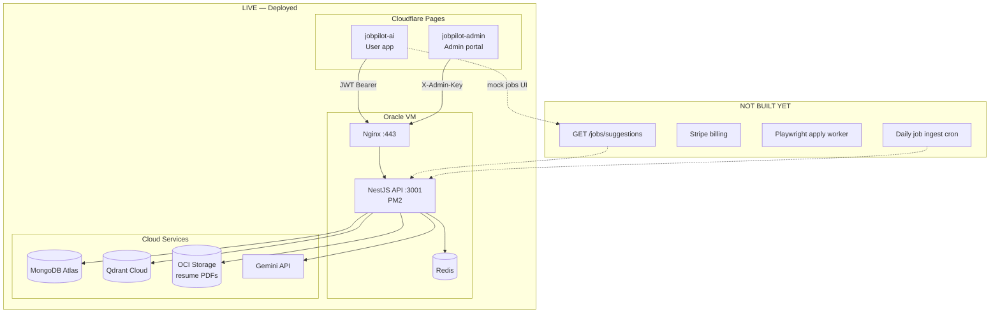
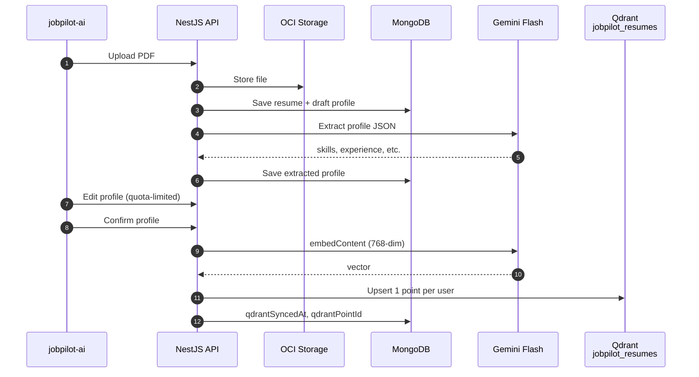
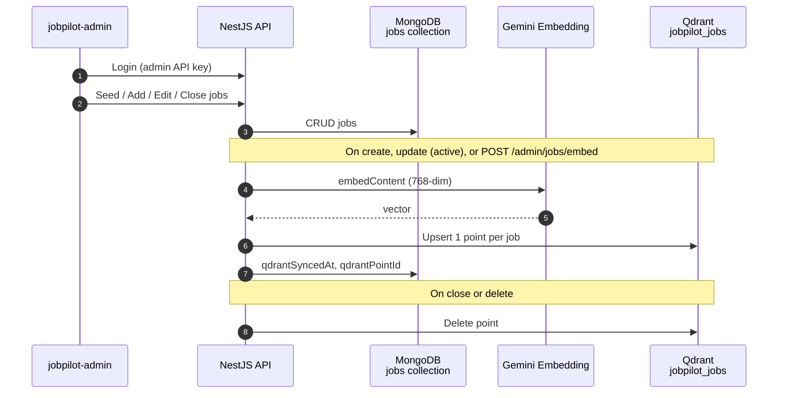
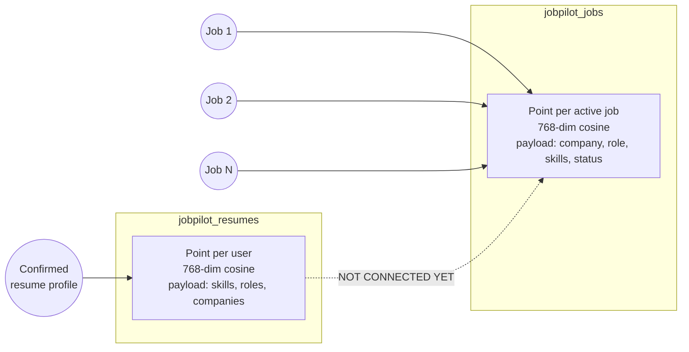
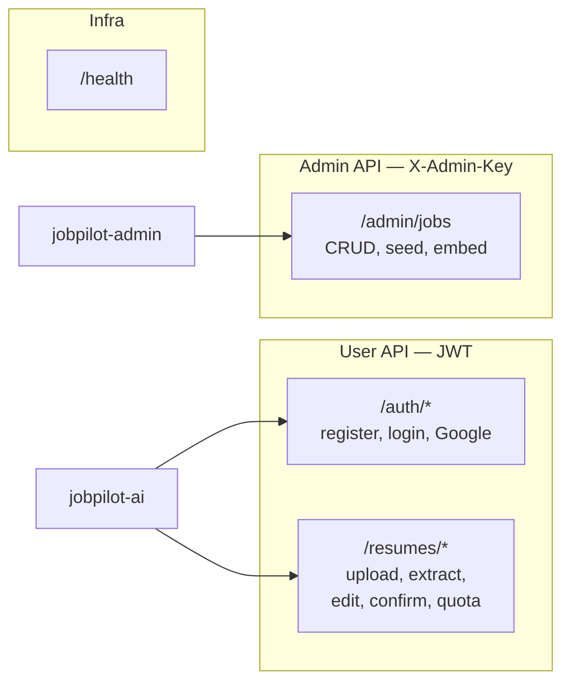
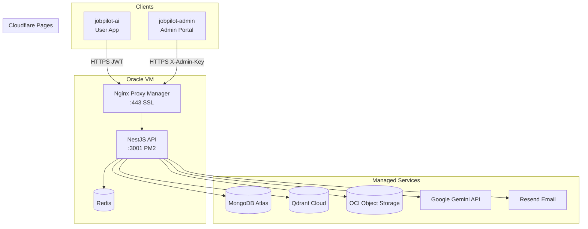
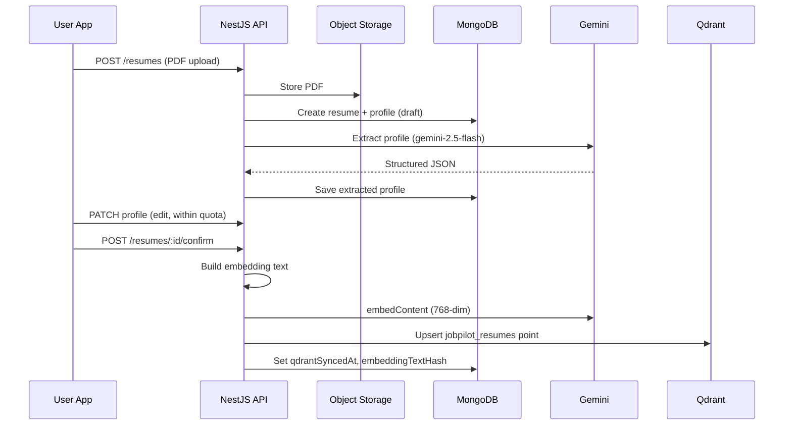
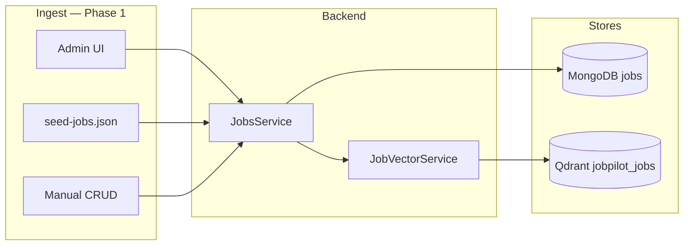
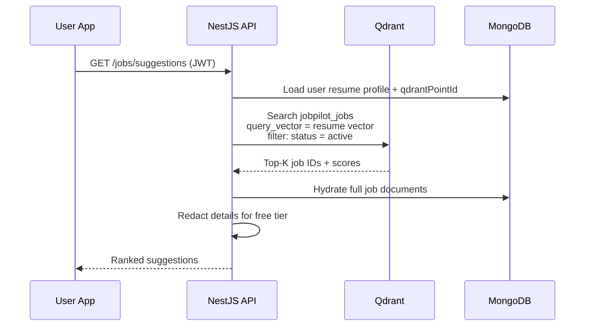
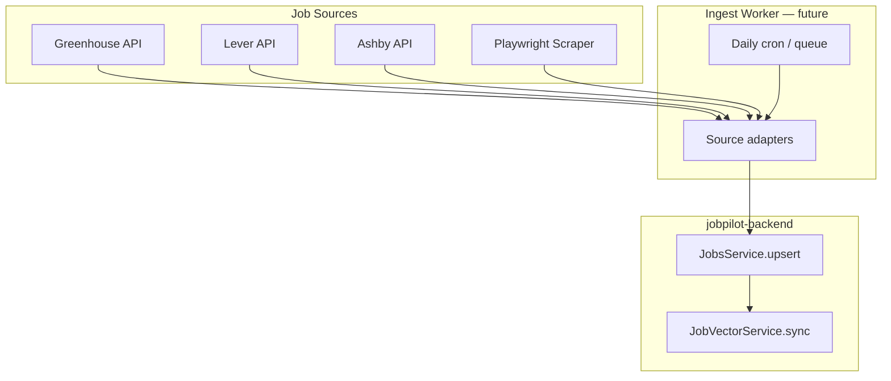

# JobPilot — System Design

> Last updated: June 2026  
> Scope: backend (`jobpilot-backend`), user app (`jobpilot-ai`), admin portal (`jobpilot-admin`)

---

## 1. Overview

JobPilot helps users upload a resume, build a structured profile, and (planned) receive AI-matched job suggestions with optional auto-apply.

| Layer | Technology | Status |
|-------|------------|--------|
| User frontend | React + Vite (Cloudflare Pages) | Live |
| Admin frontend | React + Vite (Cloudflare Pages) | Live |
| API | NestJS (Oracle VM + PM2) | Live |
| Primary DB | MongoDB Atlas | Live |
| Vector DB | Qdrant Cloud | Live |
| Cache / sessions | Redis (Docker on VM) | Live |
| LLM (extraction) | Google Gemini Flash | Live |
| Embeddings | Gemini `gemini-embedding-001` (768-dim) | Live |
| File storage | OCI Object Storage (prod) / local (dev) | Live |
| Email | Resend | Live |
| Auth | JWT + Google OAuth | Live |
| Job matching API | Vector search resume → jobs | **Planned** |
| Billing | Stripe | **Planned** |
| Auto-apply | Playwright worker (separate service) | **Planned** |

**Production API:** `https://jobpilot-api.duckdns.org`  
**User app:** Cloudflare Pages (`jobpilot-ai`)  
**Admin portal:** `https://jobpilot-admin.pages.dev`

---

## 1.1 What we have built so far (diagram)

### Deployed system today



### Resume flow (done)



### Job catalog + embedding (done)



### Data in Qdrant right now



### API surface implemented



### Status checklist

| Feature | Status |
|---------|--------|
| User auth (JWT + Google) | ✅ |
| Resume upload → OCI | ✅ |
| Gemini profile extraction | ✅ |
| Profile edit + confirm + quotas | ✅ |
| Resume embed → `jobpilot_resumes` | ✅ |
| Admin job CRUD + seed | ✅ |
| Job embed → `jobpilot_jobs` | ✅ |
| User app job suggestions (real API) | ❌ mock data |
| Resume ↔ job vector matching | ❌ |
| Stripe payments | ❌ |
| Auto-apply worker | ❌ |
| Automated job ingest | ❌ |

---

## 2. High-level architecture



### Request paths

| Client | Auth | Base path |
|--------|------|-----------|
| User app | `Authorization: Bearer <JWT>` | `/api/v1/auth`, `/api/v1/resumes` |
| Admin portal | `X-Admin-Key: <secret>` | `/api/v1/admin/jobs` |
| Health / docs | None (health), Swagger optional | `/api/v1/health`, `/api/docs` |

---

## 3. Repository layout

```
personal/
├── jobpilot-backend/     NestJS API — single source of truth
├── jobpilot-ai/          User-facing React app
└── jobpilot-admin/       Internal job catalog admin
```

All business logic lives in **one backend**. The admin app is a thin CRUD UI. A separate Playwright worker is planned later for auto-apply only.

---

## 4. Deployment topology

```text
Internet
   │
   ├── Cloudflare Pages ── jobpilot-ai.pages.dev
   ├── Cloudflare Pages ── jobpilot-admin.pages.dev
   │
   └── Duck DNS ── jobpilot-api.duckdns.org
            │
            ▼
       Oracle VM (144.24.159.70)
       ├── Nginx Proxy Manager (:443 → :3001)
       ├── PM2: jobpilot-api
       └── Docker: Redis
            │
            ├── MongoDB Atlas (cloud)
            ├── Qdrant Cloud (cloud)
            └── OCI Bucket (resumes)
```

### CI/CD

| Repo | Trigger | Deploy target |
|------|---------|---------------|
| `jobpilot-backend` | Push to `main` | GitHub Actions → SSH → `git pull` + `npm ci` + `pm2 reload` |
| `jobpilot-ai` | Push to `main` | Cloudflare Pages auto-build |
| `jobpilot-admin` | Push to `main` | Cloudflare Pages auto-build |

Backend env vars are **not** injected by CI — they live in the VM `.env` file.

---

## 5. Data stores

### 5.1 MongoDB collections

| Collection | Purpose | Key fields |
|------------|---------|------------|
| `users` | Accounts, subscription tier, quotas | `email`, `googleId`, `subscriptionTier` |
| `resumes` | Uploaded PDF metadata | `userId`, `storageKey`, `status` |
| `resume_profiles` | Extracted + confirmed profile | `skills`, `experience`, `qdrantPointId`, `embeddingTextHash` |
| `jobs` | Job catalog | `source`, `externalId`, `company`, `role`, `status`, `qdrantPointId` |
| `llm_prompts` | Versioned Gemini prompts | `key`, `version`, `content` |

**Job uniqueness:** `(source, externalId)` unique index — supports idempotent ingest from multiple sources.

### 5.2 Qdrant collections

| Collection | Env var | Vector size | Distance | One point per |
|------------|---------|-------------|----------|---------------|
| `jobpilot_resumes` | `QDRANT_COLLECTION_RESUMES` | 768 | Cosine | User (confirmed profile) |
| `jobpilot_jobs` | `QDRANT_COLLECTION_JOBS` | 768 | Cosine | Active job |

**Point ID:** deterministic UUID derived from Mongo `_id` / `userId`:

```text
SHA-256("jobpilot:{sourceId}") → formatted UUID
```

### 5.3 Redis

- Session / rate-limit backing (via `@nestjs/throttler`)
- Future: job queue, ingest workers

---

## 6. Resume pipeline (implemented)



### Embedding text (resume)

Built from: summary, years of experience, skills, experience bullets, projects, education, certifications.

### Sync rules

| Event | Qdrant action |
|-------|---------------|
| Profile confirmed | Upsert vector |
| Profile edited (confirmed) | Re-embed if text hash changed |
| Resume deleted | Delete point |
| Re-extraction | Clear sync metadata; old point removed on confirm/delete |

### Quotas (server-enforced)

| Limit | Env var | Default |
|-------|---------|---------|
| Profile edits after confirm | `PROFILE_EDIT_LIMIT` | 2 |
| Resume uploads (free) | `DEFAULT_RESUME_UPLOAD_LIMIT` | 2 |
| Resume uploads (pro) | `RESUME_UPLOAD_LIMIT_PRO` | 5 |

---

## 7. Job catalog pipeline (implemented)



### Job schema highlights

```text
source          greenhouse | lever | ashby | manual | seed | ...
externalId      unique per source
status          active | closed | draft
company, role, location, description, requiredSkills
qdrantPointId, qdrantSyncedAt, embeddingTextHash  (sync metadata)
```

### Embedding text (job)

Built from: role + company, location/remote, seniority, salary, required skills, description.

### Sync rules

| Event | Qdrant action |
|-------|---------------|
| Create / update (active) | Upsert vector |
| Close / non-active status | Delete point |
| Delete job | Delete point |
| `POST /admin/jobs/embed` | Batch backfill all active jobs |

### Admin API

| Method | Path | Description |
|--------|------|-------------|
| `GET` | `/admin/jobs` | List (paginated, filter by status) |
| `POST` | `/admin/jobs` | Create / upsert |
| `PATCH` | `/admin/jobs/:id` | Update |
| `POST` | `/admin/jobs/:id/close` | Soft close |
| `DELETE` | `/admin/jobs/:id` | Hard delete |
| `POST` | `/admin/jobs/seed` | Load `scripts/data/seed-jobs.json` |
| `POST` | `/admin/jobs/embed` | Embed all active jobs |

**Auth:** `X-Admin-Key` header vs `ADMIN_API_KEY` env var.

---

## 8. Job matching (planned — Step 3)



### Design decisions

| Topic | Decision |
|-------|----------|
| Search direction | Resume vector → job vectors (not nested loops) |
| Filter inactive jobs | Qdrant payload filter `status: active` |
| Free tier | Server-side redaction of company/description before response |
| Score threshold | Configurable minimum cosine similarity (TBD) |
| Caching | Optional Redis cache per user (TTL ~1h) |

### Why not search MongoDB?

Job descriptions are unstructured text. Vector search in Qdrant scales to millions of jobs with sub-second latency. MongoDB remains the source of truth; Qdrant is the search index.

---

## 9. Future ingest architecture (Phase 2+)



### Job expiration policy (agreed)

| Scenario | Action |
|----------|--------|
| Missing from daily sync | Soft close (`status: closed`, `closeReason: not_seen`) |
| Closed > 90 days | Hard delete from MongoDB + Qdrant |

---

## 10. Authentication & authorization

### User auth (`jobpilot-ai`)

```text
Register / login ──► JWT access token (15m) + refresh token (7d, httpOnly cookie)
Google OAuth ──► callback ──► same JWT flow
```

Guards: `JwtAuthGuard` on `/resumes/*`.

### Admin auth (`jobpilot-admin`)

```text
Login page ──► user types ADMIN_API_KEY ──► sessionStorage
Every request ──► X-Admin-Key header
```

No JWT for admin. Single shared secret (rotate via VM `.env`).

### CORS

```typescript
corsOrigins = [FRONTEND_URL, ADMIN_FRONTEND_URL]
allowedHeaders = ['Content-Type', 'Authorization', 'X-Admin-Key']
```

Both origins must match deployed URLs exactly (no trailing slash).

---

## 11. Security

| Layer | Mechanism |
|-------|-----------|
| Transport | TLS via Nginx Proxy Manager (Let's Encrypt) |
| API headers | Helmet, compression |
| Rate limiting | `@nestjs/throttler` — 100 req/min per IP |
| Input validation | `class-validator` + global `ValidationPipe` |
| Secrets | VM `.env` only — never in git or Cloudflare (except `VITE_API_URL`) |
| Admin key | Not baked into admin build; entered at login |
| Resume files | OCI private bucket; signed access pattern |
| NPM admin UI | Port 81 — SSH tunnel only, not public |

---

## 12. Environment variables (production)

### VM (`jobpilot-backend/.env`)

```env
# Core
NODE_ENV=production
PORT=3001
MONGODB_URI=mongodb+srv://...
FRONTEND_URL=https://<user-app>.pages.dev
ADMIN_FRONTEND_URL=https://jobpilot-admin.pages.dev
API_PUBLIC_URL=https://jobpilot-api.duckdns.org

# Auth
JWT_ACCESS_SECRET=...
JWT_REFRESH_SECRET=...
GOOGLE_CLIENT_ID=...
GOOGLE_CLIENT_SECRET=...
ADMIN_API_KEY=...

# AI
GEMINI_API_KEY=...
GEMINI_MODEL=gemini-2.5-flash
GEMINI_EMBEDDING_MODEL=gemini-embedding-001
EMBEDDING_VECTOR_SIZE=768

# Vector DB
QDRANT_URL=https://<cluster>.cloud.qdrant.io
QDRANT_API_KEY=...
QDRANT_COLLECTION_RESUMES=jobpilot_resumes
QDRANT_COLLECTION_JOBS=jobpilot_jobs

# Storage
STORAGE_PROVIDER=oci
OCI_REGION=ap-hyderabad-1
OCI_BUCKET_NAME=jobpilot-resumes

# Email
RESEND_API_KEY=...
```

### Cloudflare Pages

| App | Variable | Value |
|-----|----------|-------|
| `jobpilot-ai` | `VITE_API_URL` | `https://jobpilot-api.duckdns.org` |
| `jobpilot-admin` | `VITE_API_URL` | `https://jobpilot-api.duckdns.org` |

Do **not** set `VITE_ADMIN_API_KEY` in production.

---

## 13. Qdrant payload reference

### Resume point (`jobpilot_resumes`)

```json
{
  "userId": "mongo ObjectId string",
  "resumeId": "...",
  "resumeProfileId": "...",
  "qdrantPointId": "uuid",
  "embeddingModel": "gemini-embedding-001",
  "textHash": "sha256 hex",
  "confirmedAt": "ISO datetime",
  "skills": ["Go", "PostgreSQL"],
  "technologies": ["..."],
  "companies": ["Razorpay"],
  "roles": ["Senior Backend Engineer"],
  "totalYearsExperience": 5
}
```

### Job point (`jobpilot_jobs`)

```json
{
  "jobId": "mongo ObjectId string",
  "qdrantPointId": "uuid",
  "embeddingModel": "gemini-embedding-001",
  "textHash": "sha256 hex",
  "company": "Razorpay",
  "role": "Senior Backend Engineer",
  "location": "Bangalore, India",
  "isRemote": false,
  "status": "active",
  "source": "greenhouse",
  "seniority": "Senior",
  "skills": ["Go", "PostgreSQL", "Redis"],
  "discoveredAt": "ISO datetime"
}
```

---

## 14. API module map

```text
jobpilot-backend/src/modules/
├── auth/           JWT, Google OAuth, email verification
├── resumes/        Upload, extract, confirm, quota, vector sync
├── jobs/           Admin CRUD, seed, embed
├── embeddings/     Gemini embed + profile text builder
└── common/
    ├── qdrant/     Qdrant client, collection + index management
    ├── database/   MongoDB connection
    ├── redis/      Redis connection
    ├── health/     /health (Mongo, Redis, Qdrant checks)
    └── config/     env validation
```

---

## 15. Roadmap

| Phase | Feature | Status |
|-------|---------|--------|
| 1 | Auth + resume upload/extract/confirm | ✅ Done |
| 1 | Resume embedding → Qdrant | ✅ Done |
| 1 | Admin job catalog + seed | ✅ Done |
| 1 | Job embedding → Qdrant | ✅ Done |
| 2 | `GET /jobs/suggestions` + wire user app | 🔲 Next |
| 2 | Free tier job redaction | 🔲 Planned |
| 3 | Job source adapters (Greenhouse, Lever, Ashby) | 🔲 Planned |
| 3 | Daily ingest worker | 🔲 Planned |
| 4 | Stripe billing | 🔲 Planned |
| 5 | Playwright auto-apply worker (separate repo) | 🔲 Planned |

---

## 16. Related docs

- [ORACLE-DEPLOYMENT.md](./ORACLE-DEPLOYMENT.md) — VM setup, Nginx, debugging
- [README.md](../README.md) — local dev quick start
- `jobpilot-admin/README.md` — admin portal deploy
